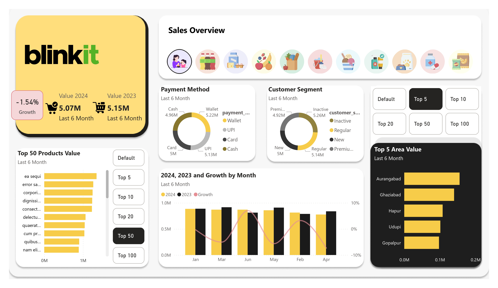
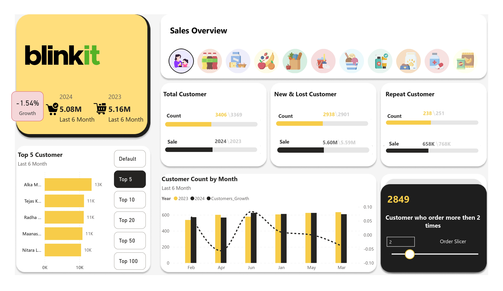
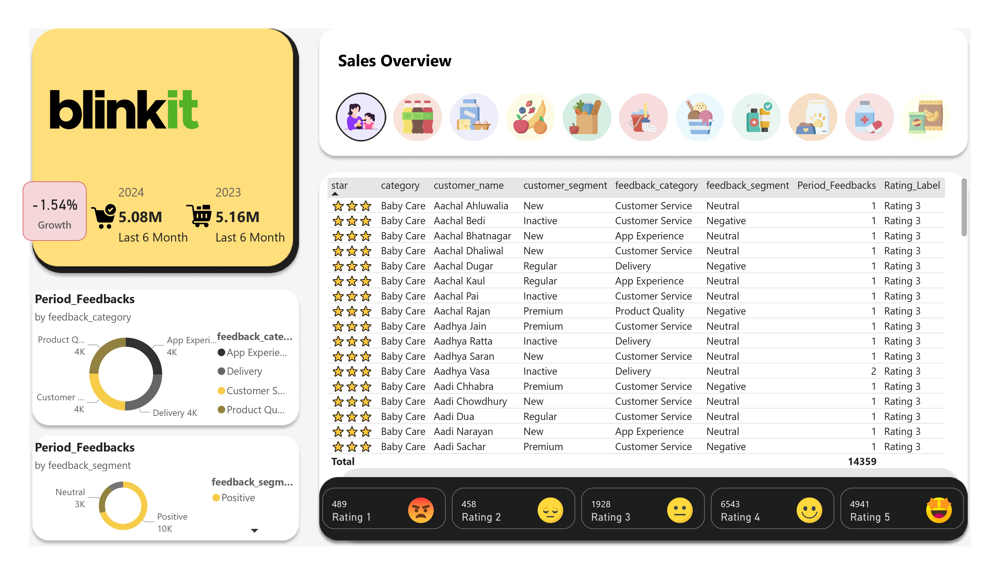

# Blinkit-Dashboard
Power BI Dashboard showcasing Blinkit sales, customers, and feedback analysis with growth insights.

# 📊 Blinkit Sales Dashboard – Power BI

This repository contains the **Blinkit Sales Dashboard** created in **Power BI**.  
The dashboard provides deep insights into sales performance, customer behavior, payment methods, top products, and customer feedback.

---

## 📂 File Included
- **Blinkit.pbix** → Interactive Power BI dashboard file (open in Power BI Desktop).  
- **Preview Images** → Screenshots of the dashboard.

---

## 🖼️ Dashboard Preview

### Page 1

### Page 2

### Page 3

---

## 🚀 Dashboard Features
- **Sales Performance**
  - Sales comparison between **2023 vs 2024 (last 6 months)**.
  - Growth tracking (current trend: **-1.54% decline**).
  - Sales by month with year-over-year growth.

- **Customer Insights**
  - Segmentation: **New, Regular, Premium, Inactive**.
  - New vs Lost vs Repeat customer tracking.
  - Customers with **2+ orders** filter.

- **Payment Method Analysis**
  - Wallet, UPI, Card, and Cash distribution.

- **Top Performers**
  - **Top Areas** (Aurangabad, Ghaziabad, Hapur, Udupi, Gopalpur).
  - **Top 50 Products** by sales value.
  - **Top Customers** by purchase.

- **Customer Feedback**
  - Ratings distribution (⭐1 to ⭐5).
  - Feedback categories: Delivery, App Experience, Customer Service, Product Quality.
  - Sentiment segmentation: Positive, Neutral, Negative.

---

## 🛠️ Tools Used
- **Power BI Desktop** – Dashboard design & data modeling.  
- **MySQL** – Source data.  

---

## 💡 How to Use
1. Download or clone this repository.  
2. Open **Blinkit.pbix** in **Power BI Desktop**.  
3. Explore interactive dashboards and apply filters.  

---

## 👨‍💻 Author
- Created by **Tushar Kunwar**  
- 📧 Contact: [tusharkunwar745@gmail.com]
- 🌐 GitHub:  [https://github.com/tushar-745]

